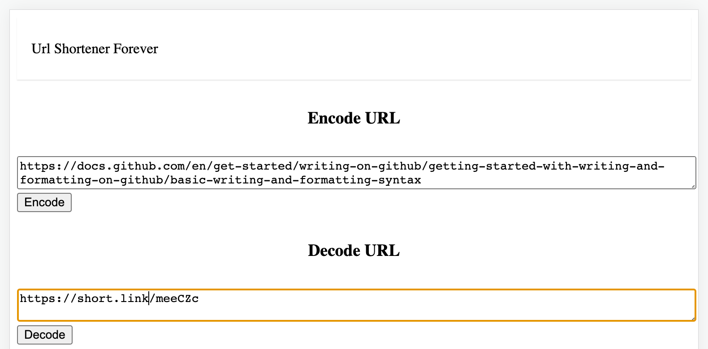

#### URL Shortener URL Instructions
> If you want to build the next bit.ly, goo.gl, or ow.ly yourself. Here are a project you might consider to start.
> 
> URL Shortener is a URL shortening service where you enter a URL such as https://codesubmit.io/library/react and it returns a short URL such as http://short.est/GeAi9K.
> 
> Simply ensure that a URL can be encoded into a short URL and that the short URL can be decoded back
into the original URL.
## Installation

Following those steps below for install project:  
* Using ruby 3.1.3 on Rails 7.0.4 for Backend API endpoints. postgresql@14 for database. To install following to (https://gorails.com/setup/)
* Using NodeJS and NPM for web frontend by ReactJS. To install following to (https://docs.npmjs.com/downloading-and-installing-node-js-and-npm)
* Clone project repository.
```shell
git clone https://github.com/lytrungtin/url_shortener.git
```
* Go to project folder
```shell
cd url_shortener
```
* Copy env values file from example
```shell
cp .env.example .env
cp config/database.yml.sample config/database.yml
```
* Bundle install
```shell
bundle install
```
* Prepare database
```shell
rails db:reset
```
* Run tests
```shell
rails test
```
* Starting backend server
```shell
rails server
```
**Open new tab of terminal to begin frontend running.**
* Install node modules required for web frontend
```shell
npm install
```
* Starting web frontend application
```shell
npm run start
```

----

# URL Shortener

**Description**:  
> Nobody likes an impossibly long URL.
>
>They're hard to decipher. But sometimes, between a deep directory structure on a site, plus a large number of parameters tacked on to the end, URLs just begin to get unwieldy. And back in the days before Twitter added their own link shortener to their service, a long URL meant taking precious characters away from your tweets.
>
>Today, people use link shorteners for a slew of reasons. They can make it much easier to type, or remember, an otherwise lengthy bare URL. They can bring a consistent branding to a social media account. They make it easier to perform analytics across a group of URLs. They make it possible to provide a consistent entryway to a URL that may change frequently on the other side.
>
>There are some challenges to URL shorteners, to be sure. They make it challenging to figure out where a link is actually taking you before you click, and they're vulnerable to [linkrot](https://en.wikipedia.org/wiki/Link_rot), should the service providing the short URL for you ever disappear. But despite these challenges, URL shorteners aren't going anywhere anytime soon.
>
>But with so many free link shortening services out there, why roll your own? In short: control. While some services will let you pick your own domain to use, sometimes, that's about the level of customization you're going to get. With a self-hosted service, you decide how long your service operates for. You decide what format your URLs take. You decide who has access to your analytics. It's yours to own and operate as you please.

(Jason Baker, [Want to build your own URL shortener?](https://opensource.com/article/17/3/url-link-shortener))

- **Two endpoints are provided**: 
  - /encode: Encodes a URL to a shortened URL
  - /decode: Decodes a shortened URL to its original URL
- **Here is [Postman collection](https://www.postman.com/lytrungtin/workspace/url-shortener/collection/3191529-d64df903-8033-49ca-a688-141b27b4031a?action=share&creator=3191529) you can download**:  
- **Links to [demo instances](https://url-shortener-forever.herokuapp.com/)**
- The project uses the latest optimization versions from [Rails](https://github.com/rails/rails), [React](https://github.com/facebook/react)

**Screenshot from web frontend**: 



## API endpoints Usage

**Valid request to /encode endpoint:**
  ```Ruby
  POST /api/v1/url/encode

  {
    "url": {
      "original_url": "https://codesubmit.io/library/react"
    }
  }
  ```
**Body success response from /encode endpoint:**
  ```Ruby
  200 OK

  {
    "status": true,
    "data": [
      {
        "shortened_url": "http://localhost:3000/rxjODc"
      }
    ]
  }
  ```
**Invalid request to /encode endpoint:**
  ```Ruby
  POST /api/v1/url/encode

  {
    "url": {
      "original_url": "https://google.com/something_wrong"
    }
  }
  ```
**Body failure response from /encode endpoint:**
  ```Ruby
  422 Unprocessable Entity
  
  {
    "status": false,
    "errors": [
      "Original url is invalid"
    ]
  }
  ```
**Valid request to /decode endpoint:**
  ```Ruby
  POST /api/v1/url/decode

  {
      "url": {
          "shortened_url": "http://localhost:3000/rxjODc"
      }
  }
  ```
**Body success response from /decode endpoint**
  ```Ruby
  200 OK

  {
    "status": true,
    "data": [
        {
            "original_url": "https://codesubmit.io/library/react"
        }
    ]
  }
  ```
**Invalid request to /decode endpoint**
  ```Ruby
  POST /api/v1/url/decode

  {
      "url": {
          "shortened_url": "https://codesubmit.io/this_is_not_shortened_url"
      }
  }
  ```
**Body failure response from /decode endpoint**
  ```Ruby
  422 Unprocessable Entity

  {
      "status": false,
      "errors": [
          "Shorten URL is not valid"
      ]
  }
  ```
**Known issues**:  
- **Potential issues**:
  - Users can exploit [Xkcd 1171](https://xkcd.com/1171/) to insert malicious URLs into our endpoints. 
  The Ruby standard library already comes with an URI parser, accessible via [URI.parse](https://ruby-doc.org/stdlib-3.1.2/libdoc/uri/rdoc/URI.html#method-c-parse).
  - Users can also pass links with vulnerable to [Link rot](https://en.wikipedia.org/wiki/Link_rot),
    An HTTP client for Ruby [Net::HTTP](https://ruby-doc.org/stdlib-3.1.2/libdoc/net/http/rdoc/Net/HTTP.html) provides a very powerful library.
    Net::HTTP is designed to work with [URI](https://ruby-doc.org/stdlib-3.1.2/libdoc/uri/rdoc/URI.html). 
    Finally, I will check if the request was successful or will be redirected to another url.
  - Rails provides an API to create custom validations. We will use this to build a URL validator that. 
  - Also, the original url should not be from current host. Which only for shortened url.
  - The validator code below is being placed in [`app/validators/url_validator.rb`](https://github.com/lytrungtin/url_shortener/blob/main/app/validators/url_validator.rb)
- **Scalability issues**:
  - The project uses Net:HTTP to get request from other sites a lot. 
  - In addition to queries database, Take full advantage of Rails’ built-in action, page and fragment caching. 
  - Use memcache to cache results that you’d otherwise pull from your database or request info from urls.
  - In addition to using database to store slugs along original urls, we can generate them to html, json, yaml. 
  - Implement use RDMS less, fully change to Redis for storing. Remove database connection for all requests.
  - Reconfiguring the server when accessing it will redirect directly from the file without querying any data from the database.

- **Maintainability**:
  - Should implement RSPEC for unit test.
  - Github actions, Heroku pipeline, PR preview env, staging env already installed workflows, and activated package issues security alert bots can proactively inform notifications if dependencies need to be updated or replaced.
  
